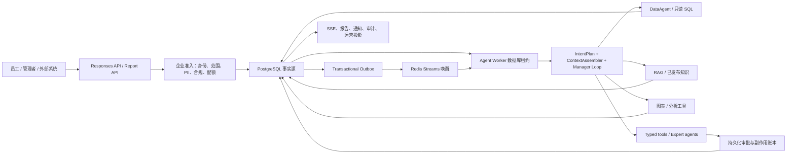
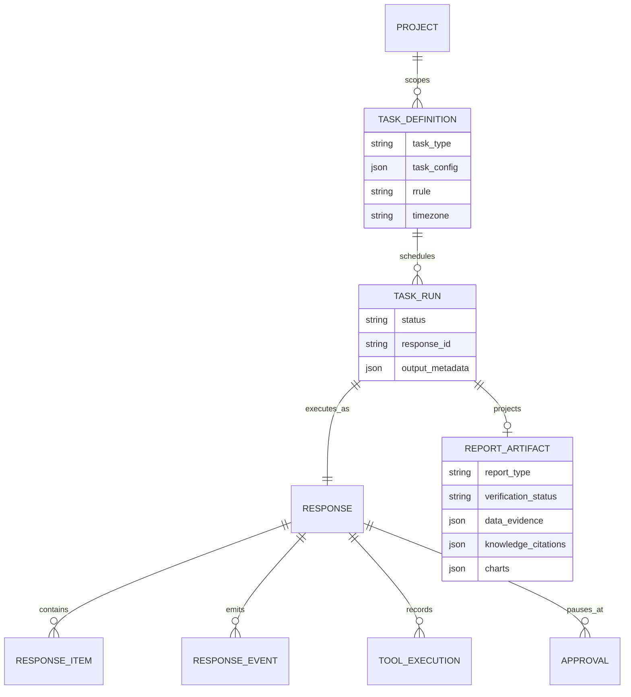
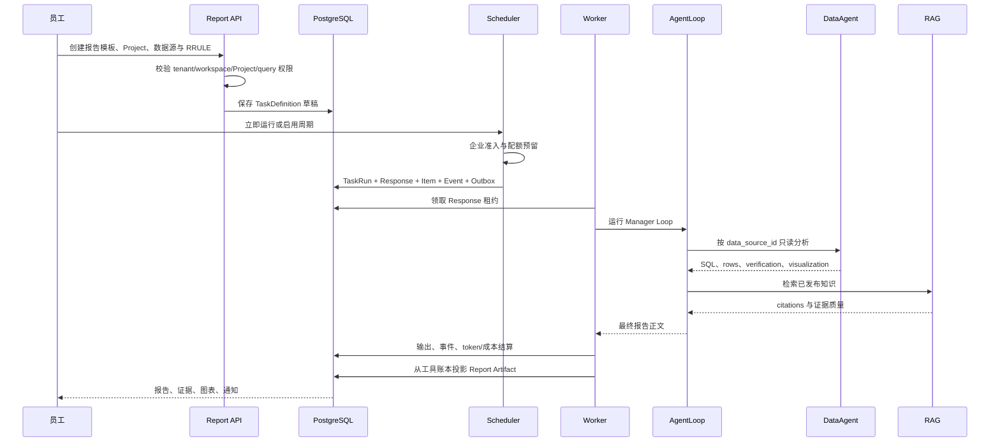

# 企业组织操作系统：一次性目标架构

## 1. 架构结论

OpenTrace 采用“一条命令主链、一个事实源、多个能力投影”的架构。在线与后台任务统一创建 Response；API 只校验和提交，Worker 独占模型及工具执行。DataAgent、RAG、图表、Skill 和专家 Agent 都是 Manager Agent Loop 的能力，不建立独立业务运行时。



## 2. 分层与所有权

| 层 | 所有权 | 可以做 | 禁止做 |
|---|---|---|---|
| Experience | Web、企业 IM、API Client | 配置、查看、审批、续传 | 在浏览器拼接权威证据 |
| Command API | `/api/v2/responses`、`/api/v2/reports` | 鉴权、范围校验、幂等、事务提交 | 运行模型、background task 偷跑 |
| Control Plane | Responses admission、宪法、ACL | PII、合规、配额、能力生命周期判断 | 生成业务答案 |
| Durable Runtime | Response Repository、Worker、Scheduler | Outbox、租约、重试、恢复、审批 | 把 Redis 当事实源 |
| Agent Runtime | AgentLoop、ContextAssembler、Model Gateway | 规划、最小能力选择、工具循环、合成 | 直接实例化 provider client |
| Capability | DataAgent、RAG、Chart、Skill、Tools | 返回结构化结果与 Evidence | 绕过 Project/tenant 范围 |
| Projection | SSE、Report Artifact、Notification、Audit | 从持久化记录生成读模型 | 将模型正文升级为事实 |

## 3. 核心领域模型



`TaskDefinition.task_type=enterprise_report` 表示报告过程；`task_config` 固化模板版本、Project、数据源、阅读对象、章节和证据要求。`TaskRun.output_metadata` 是从 ResponseToolExecution 投影的可验证产物，不是第二份事实源，可随投影版本重建。

## 4. 三个灯塔模板

| 类型 | 主要问题 | 默认节奏 | 知识要求 | 固定交付 |
|---|---|---|---|---|
| `data_insight` | 指标为何变化、异常在哪里 | 每周 | 可选 | 指标、归因、风险、行动 |
| `monthly_report` | 上月结果、同比环比、目标差距 | 每月 1 日 | 可选 | 月度摘要、指标、差距、下月计划 |
| `management_brief` | 管理层应知道和决策什么 | 每周一 | 必须 | 决策摘要、经营事实、制度约束、风险、待决策项 |

报告验证条件：至少一个 DataAgent 结果包含只读 SQL 且 verification status 为 `pass`；至少一个图表投影；要求企业知识时至少一个 RAG citation。任一缺失都进入 `needs_review`，TaskRun 为 `incomplete`。

## 5. 运行序列



## 6. API 契约

- `POST /api/v2/responses`：所有在线回合的唯一命令入口。
- `GET /api/v2/reports/templates`：读取稳定模板合同。
- `POST /api/v2/reports`：创建报告任务草稿；不直接执行模型。
- `GET /api/v2/reports`：列出当前 user/tenant/workspace 的报告定义。
- `GET /api/v2/reports/{id}`：读取运行、报告产物和证据投影。
- `POST /api/v2/scheduled-tasks/{id}/run`：立即运行，不改变周期。
- `POST /api/v2/scheduled-tasks/{id}/actions/{action}`：启用、暂停或取消。

## 7. 安全与可靠性不变量

1. 创建和读取同时匹配 user、tenant、workspace；报告数据源还必须属于 Project 且具备 query 权限。
2. PostgreSQL 是执行状态与证据事实源；Redis 不可用时 Worker 通过数据库 claim 恢复。
3. 父 Response 创建后显式 flush，再写 Item、Event 和 Outbox。
4. 只读能力自动执行；write/destructive 工具必须持久化审批，未知结果不自动重试。
5. 每个 Response 保存企业准入快照、实际 token、成本归属和结算版本。
6. SSE 断开不取消 Response，sequence number 支持断点续传。
7. Beta 发布评测必须读取真实主链结果目录，fixture 不具备放量资格。

## 8. Beta 与 GA 门槛

企业 Beta 面向受控租户，要求主链合同、租户隔离、迁移单头、恢复语义、前端构建和真实 Golden Results 全部通过。执行：

```bash
ENTERPRISE_EVAL_RESULTS_DIR=/path/to/real-results \
  bash scripts/run_responses_beta_gate.sh --release
```

GA 还需要生产 SLO、容量压测、备份恢复演练、跨版本升级回滚、安全评审、账单 exactly-once 对账和至少一个季度的受控试点数据；这些不能用单元测试替代。
