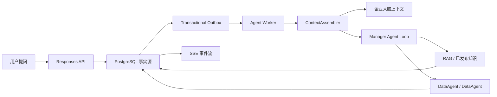

# OpenTrace 提问主链架构

## 架构结论

OpenTrace 只有一条在线产品主链：`POST /api/v2/responses`。前端以 `/chat` 提问页为中心，
API 负责鉴权、范围校验、幂等和事务提交，Worker 负责模型与能力执行。

## 能力边界

| 能力 | 用途 | 在线暴露方式 |
|---|---|---|
| 企业大脑 | 公司、部门、术语和组织语境 | ContextAssembler 注入，不作为工具 |
| RAG | 从有权限的已发布知识检索证据 | `rag` Agent |
| DataAgent | 在授权数据源上生成、校验和执行只读 SQL | `data` Agent |

Agent topology manifest、bootstrap、Worker 和 AgentLoop 必须保持同一集合：`data`、`rag`。
任何未列入集合的旧能力都不得被注册、投递或暴露给规划器。

## 页面与权限

普通用户页面是提问、我的资料、数据库、个人记忆、任务、Skills 和设置；管理员额外维护企业
大脑、企业知识库、知识库质量中心和权限。旧工作台、报告、审计、预警、规则、集成页面及
其路由均不属于产品面。

## 可靠性不变量

1. PostgreSQL 是 Response、Item、Event、Outbox、审批和工具账本的事实来源。
2. Redis 仅用于投递和唤醒；丢失消息时 Worker 通过数据库租约恢复。
3. API 进程不运行模型、工具或后台任务。
4. SSE 断开不会取消 Response，客户端可按 sequence number 续传。
5. 资源访问同时匹配 user、tenant、workspace 以及 Project/数据源权限。
