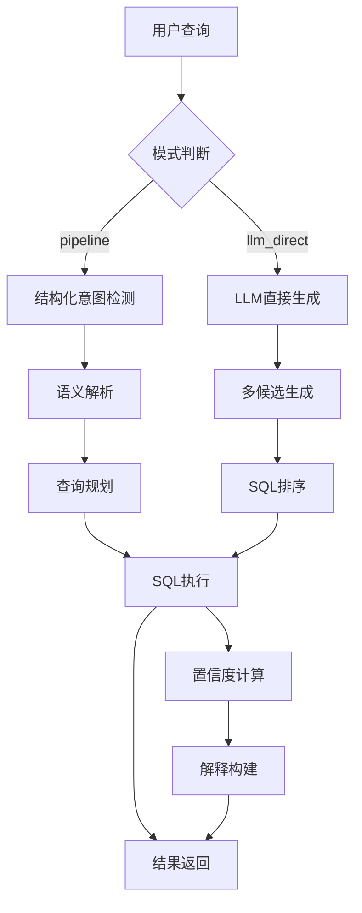
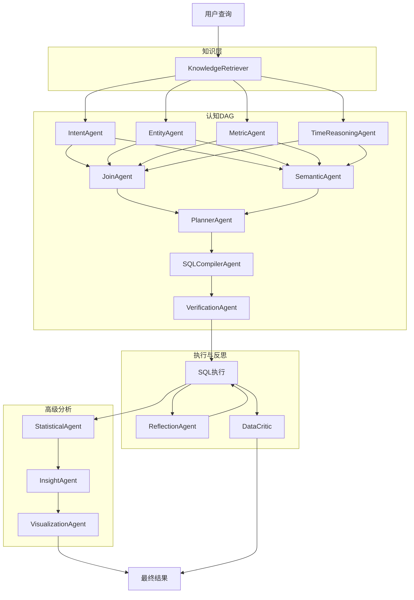
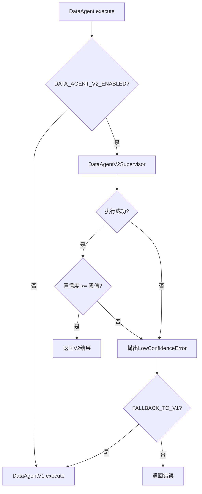

# DataAgent 数据查询智能体模块

## 1. 模块概述

**一句话描述**：DataAgent 是 OpenTrace 系统中负责将自然语言查询转换为 SQL 并执行的核心智能体，支持 V1 单一路由和 V2 认知管线两种架构模式。

**业务价值**：通过自然语言接口让非技术用户能够查询数据库，降低数据分析门槛，实现"用自然语言问数据"的核心价值主张。该模块是企业级数据智能平台的关键组件，支持多数据库类型、多租户隔离、查询优化和安全防护。

---

## 2. 核心职责

- **自然语言到 SQL 的转换**：将用户的自然语言查询解析为可执行的 SQL 语句
- **多数据库支持**：支持 PostgreSQL、MySQL、ClickHouse、Doris 等多种数据库类型
- **Schema 感知**：自动加载和利用数据库元数据进行智能查询生成
- **查询验证与优化**：对生成的 SQL 进行安全性检查、语法验证和性能优化
- **执行与结果返回**：执行 SQL 并将结果格式化为用户友好的响应
- **知识增强**：整合业务指标定义、维度映射和查询模式库
- **反思与修复**：V2 版本支持执行结果反思和自动修复

---

## 3. 关键策略与算法

### 3.1 架构演进策略

**当初设计时为什么选择这个方案**：

早期版本（V1）采用单一路由模式，通过 LLM 直接生成 SQL，虽然实现简单但存在以下问题：
1. 缺乏结构化推理，复杂查询准确率低
2. 没有知识层支撑，业务概念解析困难
3. 执行失败后无法自动修复
4. 难以追踪和调试推理过程

因此设计了 V2 架构，采用多 Agent 认知管线模式，将复杂的 NL2SQL 问题拆解为多个子任务，通过 DAG 调度并行执行，实现更高的准确率和可解释性。

**实现时的关键代码片段**：

```python
# V2 Supervisor 核心执行流程
async def execute(self, task: TaskMessage) -> AgentResult:
    # 1. 初始化认知上下文
    ctx = self._init_context(task)
    
    # 2. 加载数据源元数据
    await self._load_datasource_metadata(task, ctx)
    
    # 3. 知识层检索
    if knowledge_enabled:
        ctx = await self._run_knowledge_layer(task, ctx)
    
    # 4. 模式匹配快速路径
    if ctx.pattern_hit and ctx.pattern_hit.get("successful_sql"):
        ctx.compiled_sql = ctx.pattern_hit["successful_sql"]
    else:
        # 5. 构建并执行认知 DAG
        dag = build_cognitive_dag(query=ctx.query, ...)
        ctx = await self._execute_dag(task, ctx, dag)
    
    # 6. SQL 执行
    result_ctx = await self._execute_sql(task, ctx)
    
    # 7. 反思修复（Phase 2.1）
    if reflection_enabled:
        result_ctx = await self._run_reflection(task, result_ctx)
    
    # 8. 置信度熔断 → V1 降级
    if result.confidence < threshold:
        raise LowConfidenceError(...)
```

**测试时发现的调整**：

1. **置信度阈值调整**：初始阈值设置为 0.5，但测试发现过于严格导致频繁降级到 V1，最终调整为 0.4
2. **DAG 并行超时**：初始设置 15 秒，复杂查询经常超时，调整为 30 秒并增加信号量控制
3. **知识层失败处理**：最初知识层失败会导致整个流程失败，后来改为静默降级，继续执行后续步骤
4. **模式匹配优先级**：模式匹配成功后直接跳过 DAG 执行，节省大量时间

### 3.2 V1 Pipeline 模式策略

**当初设计时为什么选择这个方案**：

Pipeline 模式将 NL2SQL 分解为多个阶段，每个阶段有明确的职责，便于维护和调试。相比直接 LLM 生成，Pipeline 模式具有以下优势：
- 结构化推理，可追溯性强
- 每个阶段可以独立优化
- 失败时可以精确定位问题
- 支持规则引擎和 LLM 混合使用

**实现时的关键代码片段**：

```python
async def _execute_pipeline(
    self, task: TaskMessage, ds: DataSource, dialect: SQLDialectSpec,
    data_source_id: str, schema_hint: str, table_names: list[str],
    table_columns: dict[str, list[str]], semantic_config: dict[str, Any],
) -> AgentResult:
    # Step 1: 检查结构化意图（表计数、表列表、表结构）
    structured_sql = self._semantic_parser.check_structured_intent(
        task.query, table_names, ds.database, dialect
    )
    if structured_sql:
        safe_sql = self.validator.validate(structured_sql)
        return await self._execute_and_return(task, safe_sql, ...)

    # Step 2: 语义解析
    semantics = await self._semantic_parser.parse(task.query, dialect)

    # Step 3: 查询规划
    plan = await self._query_planner.plan(
        semantics=semantics, query=task.query,
        table_names=table_names, schema_summary=schema_hint,
        dialect=dialect, table_columns=table_columns,
    )

    # Step 4: 带自验证的执行 + 自动重试
    rows, final_sql, warnings = await self._query_executor.run_with_retry(
        plan=plan, dsn=dsn, dialect=dialect,
        query=task.query, schema_hint=schema_hint,
    )

    # Step 5: 构建解释
    explanation = build_explanation(plan, final_sql, rows, task.query, warnings)
```

**测试时发现的调整**：

1. **结构化意图检测**：初始只支持 `table_count`、`table_list`、`table_schema` 三种意图，测试发现还需要支持 `describe_table` 和 `column_info`
2. **语义解析失败降级**：语义解析失败时直接返回错误，后来改为降级到 llm_direct 模式
3. **查询规划失败处理**：规划失败时同样需要降级，避免整个流程中断
4. **执行重试次数**：初始设置 1 次重试，复杂查询经常失败，调整为 2 次

### 3.3 V2 认知 DAG 构建策略

**当初设计时为什么选择这个方案**：

将 NL2SQL 问题分解为多个独立的认知子任务，通过 DAG 调度实现并行执行，提高整体效率。每个子代理专注于一个特定的认知功能：
- IntentAgent：识别查询意图
- EntityAgent：实体识别和表映射
- MetricAgent：指标定义解析
- TimeReasoningAgent：时间窗口推理
- JoinAgent：表连接路径分析
- SemanticAgent：语义解析
- PlannerAgent：查询计划生成
- SQLCompilerAgent：SQL 编译
- VerificationAgent：验证

**实现时的关键代码片段**：

```python
# DAG 节点注册
AGENT_REGISTRY.update({
    "data_knowledge": KnowledgeRetrieverAgent,
    "data_intent": IntentAgent,
    "data_entity": EntityAgent,
    "data_metric": MetricAgent,
    "data_time": TimeReasoningAgent,
    "data_join": JoinAgent,
    "data_semantic": SemanticAgent,
    "data_planner": PlannerAgent,
    "data_compiler": SQLCompilerAgent,
    "data_verification": VerificationAgent,
})

# DAG 构建逻辑
def build_cognitive_dag(query: str, enabled: dict, parallel: bool = True, is_metadata: bool = False) -> DagPlanSpec:
    nodes = []
    edges = []
    
    # 元数据查询快速路径
    if is_metadata:
        nodes.append(DagNodeSpec(id="intent", agent_type="data_intent", ...))
        nodes.append(DagNodeSpec(id="verification", agent_type="data_verification", ...))
        edges.append(("intent", "verification"))
        return DagPlanSpec(nodes=nodes, edges=edges)
    
    # 完整认知管线
    # 第一层：并行执行的基础认知任务
    first_layer = ["intent", "entity", "metric", "time"]
    for node_id in first_layer:
        nodes.append(DagNodeSpec(id=node_id, agent_type=f"data_{node_id}", ...))
    
    # 第二层：需要第一层结果的任务
    nodes.append(DagNodeSpec(id="join", agent_type="data_join", ...))
    nodes.append(DagNodeSpec(id="semantic", agent_type="data_semantic", ...))
    for src in first_layer:
        edges.append((src, "join"))
        edges.append((src, "semantic"))
    
    # 第三层：规划和编译
    nodes.append(DagNodeSpec(id="planner", agent_type="data_planner", ...))
    nodes.append(DagNodeSpec(id="compiler", agent_type="data_compiler", ...))
    edges.append(("join", "planner"))
    edges.append(("semantic", "planner"))
    edges.append(("planner", "compiler"))
    
    # 第四层：验证
    nodes.append(DagNodeSpec(id="verification", agent_type="data_verification", ...))
    edges.append(("compiler", "verification"))
    
    return DagPlanSpec(nodes=nodes, edges=edges, parallel=parallel)
```

**测试时发现的调整**：

1. **并行执行控制**：初始所有节点都并行执行，但某些节点有依赖关系，需要通过 edges 明确指定
2. **元数据查询优化**：元数据查询（如"有哪些表"）不需要完整管线，添加快速路径
3. **节点超时设置**：不同节点复杂度不同，需要设置差异化超时时间
4. **失败隔离**：单个节点失败不应影响其他节点，增加失败隔离机制

### 3.4 置信度计算策略

**当初设计时为什么选择这个方案**：

置信度是决定是否降级到 V1 的关键指标，需要综合考虑多个因素：
- SQL 是否成功生成
- 执行是否返回结果
- 结果行数是否合理
- 上游认知代理的输出质量
- 验证报告状态
- 高级分析结果

**实现时的关键代码片段**：

```python
def _compute_confidence(self, ctx: CognitiveContext, rows: list, sql: str) -> float:
    confidence = 0.60  # 基础分
    
    # SQL 生成成功
    if sql:
        confidence += 0.10
    
    # 有执行结果
    if rows:
        confidence += 0.10
        if len(rows) > 1:
            confidence += 0.05  # 多行结果更可信
    
    # 上游认知质量
    if ctx.metrics:
        confidence += 0.05
    if ctx.entities:
        confidence += 0.05
    
    # 验证通过
    if ctx.verification_report and ctx.verification_report.get("status") == "pass":
        confidence += 0.05
    
    # 高级分析奖励
    if ctx.statistical_report:
        confidence += 0.03
    if ctx.insights and ctx.insights.get("confidence", 0) > 0.7:
        confidence += 0.03
    if ctx.visualization_config:
        confidence += 0.02
    
    # 验证警告惩罚
    if ctx.verification_report:
        issues = ctx.verification_report.get("issues", [])
        confidence -= 0.02 * len([i for i in issues if i["severity"] in ("high", "critical")])
    
    return max(0.1, min(0.99, confidence))
```

**测试时发现的调整**：

1. **基础分调整**：初始基础分 0.5，测试发现过于保守，调整为 0.6
2. **多行奖励**：初始只有行数判断，后来增加了至少 3 行才给额外奖励
3. **验证惩罚**：初始没有惩罚机制，后来发现验证警告需要适当降低置信度
4. **高级分析奖励**：初始没有考虑高级分析，后来增加了统计分析、洞察和可视化的奖励

---

## 4. 输入/输出/依赖的外部服务

### 4.1 输入

| 数据结构 | 来源 | 说明 |
|---------|------|------|
| `TaskMessage` | Agent Runtime | 任务消息，包含查询、参数、会话信息 |
| `DataSource` | 数据库 | 数据源配置（连接信息、类型、schema） |
| `DataSourceSchema` | 数据库 | 数据源的 schema 定义和语义映射 |
| `SchemaInspection` | 元数据检查器 | 表名、列名、外键关系 |

### 4.2 输出

| 数据结构 | 用途 | 说明 |
|---------|------|------|
| `AgentResult` | 认知内核 | 执行结果，包含状态、内容、置信度、元数据 |
| `CognitiveContext` | V2 内部 | 累积的认知状态，在子代理间传递 |
| `ResultRef` | 结果引用 | SQL 和表格结果的结构化引用 |

### 4.3 依赖的外部服务

| 服务 | 用途 | 调用时机 |
|------|------|----------|
| LLM Gateway | SQL 生成、语义解析、意图识别 | 多个子代理需要 |
| PostgreSQL | 数据源配置存储、认知事件记录 | 运行时 |
| Redis | 模式匹配缓存 | 知识层检索 |
| 目标数据库 | SQL 执行 | 查询执行阶段 |

---

## 5. 关键函数/类说明

### 5.1 DataAgent 类

**功能**：DataAgent 包装器，根据配置决定使用 V1 还是 V2 实现

**核心方法**：

| 方法 | 功能 | 参数 | 返回值 |
|------|------|------|--------|
| `__init__()` | 初始化，读取配置决定启用哪个版本 | 无 | 无 |
| `execute(task)` | 执行数据查询任务 | `task`: TaskMessage | `AgentResult` |
| `_get_v1()` | 懒加载 V1 实例 | 无 | `DataAgentV1` |

### 5.2 DataAgentV1 类

**功能**：原始实现，支持 pipeline 和 llm_direct 两种模式

**核心方法**：

| 方法 | 功能 | 参数 | 返回值 |
|------|------|------|--------|
| `execute(task)` | 执行查询，根据模式选择执行路径 | `task`: TaskMessage | `AgentResult` |
| `_execute_pipeline(...)` | 使用多阶段管线执行 | 多个参数 | `AgentResult` |
| `_execute_llm_direct(...)` | 使用 LLM 直接生成 SQL | 多个参数 | `AgentResult` |
| `_compute_confidence(rows, ctx, mode)` | 计算置信度 | `rows`: 结果行, `ctx`: 语义上下文, `mode`: 执行模式 | `float` |

### 5.3 DataAgentV2Supervisor 类

**功能**：V2 认知管线的协调器，编排多个子代理

**核心方法**：

| 方法 | 功能 | 参数 | 返回值 |
|------|------|------|--------|
| `execute(task)` | 完整的 V2 管线执行 | `task`: TaskMessage | `AgentResult` |
| `_run_knowledge_layer(task, ctx)` | 运行知识层检索 | `task`: TaskMessage, `ctx`: CognitiveContext | `CognitiveContext` |
| `_execute_dag(task, ctx, dag)` | 执行认知 DAG | `task`: TaskMessage, `ctx`: CognitiveContext, `dag`: DagPlanSpec | `CognitiveContext` |
| `_execute_sql(task, ctx)` | 执行编译后的 SQL | `task`: TaskMessage, `ctx`: CognitiveContext | `CognitiveContext` |
| `_run_reflection(task, ctx)` | 运行反思修复 | `task`: TaskMessage, `ctx`: CognitiveContext | `CognitiveContext` |
| `_build_final_result(task, ctx, t0)` | 构建最终结果 | `task`: TaskMessage, `ctx`: CognitiveContext, `t0`: 开始时间 | `AgentResult` |

### 5.4 CognitiveContext 类

**功能**：V2 管线中传递的认知上下文，累积所有子代理的输出

**核心字段**：

| 字段 | 类型 | 说明 |
|------|------|------|
| `query` | str | 用户查询 |
| `data_source_id` | str | 数据源 ID |
| `dialect` | str | SQL 方言 |
| `schema_hint` | str | Schema 摘要 |
| `intent` | dict | 意图识别结果 |
| `entities` | list | 实体映射列表 |
| `metrics` | list | 指标映射列表 |
| `time_window` | dict | 时间窗口 |
| `join_paths` | list | 连接路径 |
| `logical_plan` | dict | 逻辑查询计划 |
| `compiled_sql` | str | 编译后的 SQL |
| `verification_report` | dict | 验证报告 |
| `execution_rows` | list | 执行结果行 |
| `execution_error` | str | 执行错误 |

### 5.5 PlannerAgent 类

**功能**：将所有上游认知输出聚合为 LogicalPlan

**核心方法**：

| 方法 | 功能 | 参数 | 返回值 |
|------|------|------|--------|
| `execute(task)` | 生成逻辑查询计划 | `task`: TaskMessage | `AgentResult` |
| `_generate_plan(ctx)` | LLM 生成计划 | `ctx`: CognitiveContext | `dict` |
| `_fallback_plan(ctx)` | 降级计划生成 | `ctx`: CognitiveContext | `dict` |
| `_validate_plan(plan, ctx)` | 验证计划 | `plan`: 计划字典, `ctx`: CognitiveContext | `list[str]` |

---

## 6. 配置项说明

### 6.1 V2 启用配置

```python
# 启用 V2 版本
DATA_AGENT_V2_ENABLED=true

# 置信度过低时降级到 V1
DATA_AGENT_V2_FALLBACK_TO_V1=true

# 置信度阈值
DATA_AGENT_V2_CONFIDENCE_THRESHOLD=0.40

# DAG 并行执行超时（秒）
DATA_AGENT_V2_DAG_PARALLEL_TIMEOUT_SEC=30

# 是否启用并行执行
DATA_AGENT_V2_DAG_PARALLEL_ENABLED=true

# 最大重试次数
DATA_AGENT_V2_SUPERVISOR_MAX_RETRIES=2
```

### 6.2 知识层配置

```python
# 启用知识检索
DATA_AGENT_V2_KNOWLEDGE_RETRIEVER_ENABLED=true

# 启用模式匹配
DATA_AGENT_V2_PATTERN_MEMORY_ENABLED=true
```

### 6.3 高级分析配置（Phase 4）

```python
# 统计分析
DATA_AGENT_V2_STATISTICAL_ENABLED=false

# 洞察生成
DATA_AGENT_V2_INSIGHT_ENABLED=false

# 可视化推荐
DATA_AGENT_V2_VISUALIZATION_ENABLED=false
```

### 6.4 反思与审校配置（Phase 2）

```python
# 反思修复
DATA_AGENT_V2_REFLECTION_ENABLED=true

# 质量审校
DATA_AGENT_V2_CRITIC_ENABLED=true

# 学习管线
DATA_AGENT_V2_LEARNING_ENABLED=false
```

### 6.5 认知事件记录

```python
# 启用认知事件记录（审计追踪）
DATA_AGENT_V2_COGNITIVE_EVENTS_ENABLED=true
```

---

## 7. 异常场景与容错设计

### 7.1 V2 降级机制

```python
async def execute(self, task: TaskMessage) -> AgentResult:
    if not self._v2_enabled:
        return await self._get_v1().execute(task)
    
    try:
        supervisor = DataAgentV2Supervisor()
        result = await supervisor.execute(task)
        return result
    except Exception as exc:
        if self._v2_fallback:
            # LowConfidenceError: V2 完成但结果质量差
            from agents.data_agent_v2.types import LowConfidenceError
            if isinstance(exc, LowConfidenceError):
                pass  # V1 降级
            return await self._get_v1().execute(task)
        return AgentResult(
            task_id=task.task_id,
            agent_type=self.agent_type,
            status="error",
            content="",
            error=f"DataAgent V2 failed: {exc}",
        )
```

### 7.2 数据库连接异常处理

```python
except Exception as exc:
    error_msg = str(exc)
    if "access denied" in error_msg.lower() or "authentication failed" in error_msg.lower():
        error_msg = f"数据库连接失败：{error_msg}。请检查用户名和密码。"
    elif "connection refused" in error_msg.lower() or "could not connect" in error_msg.lower():
        error_msg = f"数据库连接失败：{error_msg}。请检查主机和端口，确保数据库服务正在运行。"
    elif "does not exist" in error_msg.lower() or "unknown database" in error_msg.lower():
        error_msg = f"数据库不存在：{error_msg}。请检查数据库名称。"
    elif "table" in error_msg.lower() and "not exist" in error_msg.lower():
        error_msg = f"表不存在：{error_msg}。请检查表名或同步数据库模式。"
    return AgentResult(
        task_id=task.task_id, agent_type=self.agent_type,
        status="error", content="", error=error_msg,
    )
```

### 7.3 反思修复机制

```python
async def _run_reflection(self, task: TaskMessage, ctx: CognitiveContext) -> CognitiveContext:
    try:
        from agents.data_agent_v2.reflection_agent import ReflectionAgent
        
        agent = ReflectionAgent()
        agent_task = TaskMessage(
            task_id=f"{task.task_id}_reflection",
            agent_type="data_reflection",
            query=ctx.query,
            params={
                "cognitive_context": ctx.to_dict(),
                "query": ctx.query,
                "schema_hint": ctx.schema_hint,
            },
            session_id=task.session_id,
            user_id=task.user_id,
        )
        result = await agent.execute(agent_task)
        return CognitiveContext.from_dict(
            result.metadata.get("cognitive_context", ctx.to_dict())
        )
    except Exception as exc:
        logger.warning("Supervisor operation failed", error=str(exc))
        return ctx  # 反思失败不影响主流程
```

### 7.4 DAG 节点失败隔离

```python
async def _execute_dag(self, task: TaskMessage, ctx: CognitiveContext, dag: DagPlanSpec) -> CognitiveContext:
    from kernel.dag_scheduler import DagScheduler
    
    registry = _V2BridgeRegistry()
    scheduler = DagScheduler(registry=registry, timeout_sec=timeout_sec)
    plan = to_dag_plan(dag, task)
    
    try:
        exec_result = await scheduler.execute(plan)
    except Exception as exc:
        await self._record_event(
            self._trace_id, task, "dag_execute_error",
            {"error": str(exc)}, status="error",
        )
        return ctx  # DAG 执行失败，返回当前上下文
    
    # 合并成功节点的结果
    for result in exec_result.results:
        result_ctx_dict = (result.metadata or {}).get("cognitive_context", {})
        if result_ctx_dict:
            ctx = CognitiveContext.from_dict({**ctx.to_dict(), **result_ctx_dict})
    
    return ctx
```

---

## 8. 性能注意事项

### 8.1 时间复杂度分析

| 操作 | 复杂度 | 说明 |
|------|--------|------|
| V1 pipeline 模式 | O(n) | n 为管线阶段数（5-6 个） |
| V1 llm_direct 模式 | O(1) | 单次 LLM 调用 |
| V2 DAG 执行 | O(max_depth) | 并行执行，取决于最长路径 |
| 知识层检索 | O(m) | m 为匹配的知识项数 |
| SQL 执行 | O(query_time) | 取决于数据库查询复杂度 |

### 8.2 资源消耗

| 组件 | 消耗 | 优化建议 |
|------|------|----------|
| LLM 调用 | 高 | 缓存模式匹配结果，减少 LLM 调用 |
| 数据库连接 | 中 | 使用连接池，限制并发数 |
| 内存 | 中 | CognitiveContext 序列化开销 |
| 网络 | 中 | 本地执行减少网络延迟 |

### 8.3 性能优化策略

1. **模式匹配快速路径**：如果匹配到已知查询模式，直接使用缓存的 SQL，跳过完整管线
2. **并行 DAG 执行**：无依赖的子代理并行执行，减少总耗时
3. **语义缓存**：Redis 缓存相同查询的结果
4. **超时控制**：每个阶段设置超时，避免长时间阻塞
5. **降级机制**：V2 超时或置信度过低时降级到 V1

### 8.4 监控指标

| 指标 | 说明 | 告警阈值 |
|------|------|----------|
| `data_agent_v2_success_rate` | V2 成功执行率 | < 90% |
| `data_agent_v2_degradation_rate` | 降级到 V1 的比例 | > 20% |
| `data_agent_v2_avg_latency` | V2 平均延迟 | > 15s |
| `data_agent_v1_avg_latency` | V1 平均延迟 | > 10s |
| `data_agent_cache_hit_rate` | 模式匹配命中率 | < 30% |

---

## 9. 拓扑图

### 9.1 V1 架构拓扑



### 9.2 V2 架构拓扑



### 9.3 V1/V2 切换逻辑



---

## 10. 完整架构和策略过程

### 10.1 V2 完整执行流程

```
用户查询
    │
    ▼
┌─────────────────────────────────┐
│ 1. 初始化认知上下文              │
│    - 从 TaskMessage 提取参数    │
│    - 设置默认值                  │
└──────────┬──────────────────────┘
           │
           ▼
┌─────────────────────────────────┐
│ 2. 加载数据源元数据              │
│    - 查询 DataSourceSchema      │
│    - 解析表名、列名、语义映射    │
└──────────┬──────────────────────┘
           │
           ▼
┌─────────────────────────────────┐
│ 3. 知识层检索（可选）            │
│    - 匹配指标定义               │
│    - 匹配分析技能               │
│    - 匹配表关系                 │
│    - 匹配查询模式（快速路径）    │
└──────────┬──────────────────────┘
           │
           ▼
┌─────────────────────────────────┐
│ 4. 模式匹配检查                  │
│    ├─ 命中 → 直接使用缓存SQL     │
│    └─ 未命中 → 构建认知DAG       │
└──────────┬──────────────────────┘
           │
           ▼
┌─────────────────────────────────┐
│ 5. DAG构建与执行                │
│    Layer 1: Intent/Entity/     │
│              Metric/Time       │
│    Layer 2: Join/Semantic      │
│    Layer 3: Planner/Compiler   │
│    Layer 4: Verification       │
└──────────┬──────────────────────┘
           │
           ▼
┌─────────────────────────────────┐
│ 6. SQL执行                      │
│    - 验证报告检查               │
│    - 执行编译后的SQL            │
│    - 记录执行结果               │
└──────────┬──────────────────────┘
           │
           ▼
┌─────────────────────────────────┐
│ 7. 反思修复（可选）              │
│    - 观察执行结果               │
│    - 诊断问题                   │
│    - 尝试修复                   │
└──────────┬──────────────────────┘
           │
           ▼
┌─────────────────────────────────┐
│ 8. 高级分析（可选）              │
│    - 统计分析                   │
│    - 洞察生成                   │
│    - 可视化推荐                 │
└──────────┬──────────────────────┘
           │
           ▼
┌─────────────────────────────────┐
│ 9. 置信度计算与熔断              │
│    - 综合各阶段信号             │
│    - 置信度过低 → 降级V1        │
└──────────┬──────────────────────┘
           │
           ▼
┌─────────────────────────────────┐
│ 10. 质量审校（可选）             │
│    - 可解释置信度               │
│    - 质量评估                   │
└──────────┬──────────────────────┘
           │
           ▼
┌─────────────────────────────────┐
│ 11. 学习管线（可选）             │
│    - 反馈收集                   │
│    - 模式提取                   │
│    - 知识更新                   │
└──────────┬──────────────────────┘
           │
           ▼
      最终结果
```

### 10.2 认知上下文流转

| 阶段 | 写入的字段 | 写入者 | 读取者 |
|------|-----------|--------|--------|
| 初始化 | query, data_source_id, dialect | Supervisor | 所有子代理 |
| 元数据加载 | table_names, table_columns, schema_hint | Supervisor | Intent, Entity, Metric |
| 知识层 | matched_metrics, matched_skills, pattern_hit | KnowledgeRetriever | Semantic, Planner |
| 意图识别 | intent | IntentAgent | Planner, Semantic |
| 实体识别 | entities | EntityAgent | Planner, Join |
| 指标识别 | metrics | MetricAgent | Planner, Semantic |
| 时间推理 | time_window | TimeReasoningAgent | Planner, Semantic |
| 连接分析 | join_paths | JoinAgent | Planner |
| 语义解析 | semantic_context | SemanticAgent | Planner |
| 计划生成 | logical_plan | PlannerAgent | SQLCompiler |
| SQL编译 | compiled_sql | SQLCompilerAgent | Verification, Executor |
| 验证 | verification_report | VerificationAgent | Executor, Confidence |
| 执行 | execution_rows, execution_row_count, execution_error | Supervisor | Reflection, Final Result |
| 反思 | reflection_rounds | ReflectionAgent | Confidence |
| 高级分析 | statistical_report, insights, visualization_config | Statistical/Insight/VisualizationAgent | Final Result |

### 10.3 V2 各阶段置信度贡献

| 阶段 | 置信度贡献 | 说明 |
|------|-----------|------|
| SQL 生成 | +0.10 | 成功生成 SQL |
| 执行结果 | +0.10 | 有返回数据 |
| 多行结果 | +0.05 | 返回 >= 2 行 |
| 指标识别 | +0.05 | 识别到业务指标 |
| 实体识别 | +0.05 | 识别到实体 |
| 验证通过 | +0.05 | 验证报告状态为 pass |
| 统计分析 | +0.03 | 成功执行统计分析 |
| 洞察生成 | +0.03 | 洞察置信度 > 0.7 |
| 可视化 | +0.02 | 生成可视化配置 |
| 验证警告 | -0.02/个 | 每个高/严重级警告 |

### 10.4 意图类型映射

| 意图类型 | 说明 | 示例查询 | 映射技能 |
|---------|------|---------|---------|
| aggregation | 聚合查询 | "每个地区的销售额" | — |
| filtering | 过滤查询 | "销售额大于1000的订单" | — |
| ranking | 排名查询 | "销售额最高的10个产品" | ranking |
| trend | 趋势分析 | "过去6个月的趋势" | trend |
| comparison | 对比分析 | "今年 vs 去年" | comparison |
| distribution | 分布分析 | "用户等级分布" | — |
| raw_lookup | 原始查询 | "查询用户123的订单" | — |
| metadata | 元数据查询 | "有哪些表" | — |
| anomaly_detection | 异常检测 | "哪些指标有异常" | anomaly |
| funnel | 漏斗分析 | "注册到付费转化" | funnel |
| cohort | 留存分析 | "月活用户留存" | cohort |
| composition | 构成分析 | "各部分占比" | composition |

---

**文档版本**: v1.0  
**最后更新**: 2026年5月  
**相关文件**:
- [data_agent.py](file:///Users/tuwan/work/code/agentos/opentrace/agents/data_agent.py)
- [data_agent_v2/supervisor.py](file:///Users/tuwan/work/code/agentos/opentrace/agents/data_agent_v2/supervisor.py)
- [data_agent_v2/types.py](file:///Users/tuwan/work/code/agentos/opentrace/agents/data_agent_v2/types.py)
- [data_agent_v2/planner_agent.py](file:///Users/tuwan/work/code/agentos/opentrace/agents/data_agent_v2/planner_agent.py)
- [data_agent_v2/semantic_agent.py](file:///Users/tuwan/work/code/agentos/opentrace/agents/data_agent_v2/semantic_agent.py)